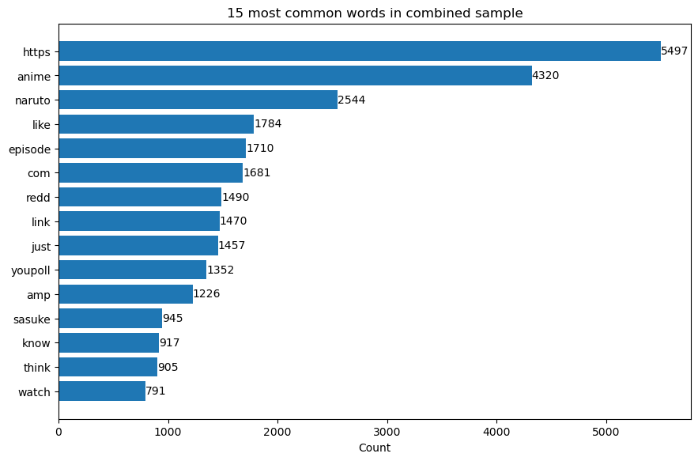

# NLP classification of subreddits - r/anime vs. r/Naruto
# 

## Problem Statement A (The No-Nonsense Version)

A number of classification algorithms are explored in conjunction with NLP (Natural Language Processing) techniques to differentiate between text from two separate but related channels (or "subreddits") from the popular website [`Reddit`](https://www.reddit.com/).  Algorithms/techniques used include: Random Forest, Naive Bayes, K Nearest Neighbors, GridSearch; Text Normalization (lemmatizing, tokenizing, stop words), CountVectorizer, TfidfVectorizer.  Text data for the project was collected via the [`Pushshift Reddit API`](https://github.com/pushshift/api).

---
## Problem Statement B (The Fun Version)

During a recent expedition to the ruins of alpha-Earth, an exploration team recovered a semi-operable server containing <b>data from the popular 21st century website [`Reddit`](https://www.reddit.com/)</b>, with intact data from two notable subreddits: [`r/anime`](https://www.reddit.com/r/anime) and [`r/Naruto`](https://www.reddit.com/r/Naruto).  

Additionally, the team discovered <b>a manual on early 21st century data science techniques for classification and machine learning</b>.  These data remnants were transmitted to my team at the Neo-Earth Research Council for further study.  

<b>Combining the wisdom of these two cultural artifacts, we use these 21st century methods to analyze this 21st century data</b>.  Fascinating, no?  While we could <i>easily</i> use our ChatGPT version 205 to classify data with 100% accuracy every time, it seemed more interesting to use the contemporary data science methods of that same 21st century to classify our data.  We explored the use of natural language processing and several classification algorithms to differentiate between posts from r/anime vs. those from r/Naruto.  

We present these findings at the 3023 Mars Conference on Pre World War 3 Humanoid Anthropology.  

---
## Executive Summary

The Random Forest (with unlimited depth, single-word n-grams only, and without using stop words) narrowly outperformed its competitors with an accuracy of 88.03%.

|Rank|Algorithm|Accuracy|
|---|---|---|
|1|Random Forest|88.03%|
|2|Naive Bayes + TfidfVectorizer|87.12%|
|3|Naive Bayes = CountVectorizer|86.28%|
|4|K Nearest Neighbors|75.19%|

The confusion matrix for the best performing model is presented below:
# 

The list of Top 15 Most Common Words in the Combined Sample (custom stopwords removed) are given below:
# 
*Though words/phrases such as "link", "poll", "anilist", etc. (tell-tale indicators of outbound links to external sites) were originally considered 'uninteresting' and removed as stopwords; their use and occurrence actually DO appear to be indicative/predictive of one subreddit over the other, and were subsequently added back in.

---
## Topic Background
<i>Why do we care? Why is this (r/anime vs. r/Naruto) a relevant comparison?</i>

To give a quick primer on the subjects of our study, in case you’re not particularly familiar with 21st century pop culture.  Anime was a term used to refer to cartoons or animation originating from the Pre-World War 3 country known as Japan.  Though there were many sub-styles and genres, the other topic of our study today was one of the most popular series within the ‘shounen’ genre, meaning literally “young boys”.  

That series is Naruto.  And while there were other very popular anime series before and after it, Naruto occupies a very unique place in animation history because its popularity coincided with (& helped fuel) an explosion in the availability and popularity of anime/manga in the Western world.  It’s effects on the genre were significant enough that it can be considered the quintessential shounen series of the early 21st century, upon which many subsequent anime tropes were based.

In the same way that few discussions of Elizabethan English literature ever completely shy away from comparisons or references to Shakespeare, many anime-related discussions in the decades following the release of Naruto would draw plot and character comparisons with and eventually circle back to the topic of Naruto.  Naruto could accurately be described as the Hamlet of the greater corpus of early 21st century anime.  For this reason, a relevant comparison exists between general discussion of anime as a whole vs. discussion specifically about Naruto.

---
## Data Background

Our data was scraped from reddit using the Pushshift Reddit API.[1]  5,000 submissions were scraped from both r/anime and r/Naruto subreddits, after which duplicates were removed.

---
## Primary Findings

- All classification algorithms tested outperformed the baseline (50.8%) significantly.  

- The Random Forest had the highest prediction accuracy (88.03%).  

- The K Nearest Neighbors method performed worst out of the algorithms evaluated.

- Though words/phrases such as "link", "poll", "anilist", etc. (tell-tale indicators of outbound links to external sites) were originally considered 'uninteresting' and removed as stopwords; their use and occurrence actually DO appear to be indicative/predictive of one subreddit over the other, and were subsequently added back in.

### Ranking of Classification Algorithms used:

|Rank|Algorithm|Accuracy|
|---|---|---|
|1|Random Forest|88.03%|
|2|TfidfVectorizer|87.12%|
|3|Naive Bayes|86.28%8|
|4|K Nearest Neighbors|75.19%|

---
## Comments/Instructions for Graders

- Initial data grab via API is performed in 'my-project3-getdata.ipynb'

- Datasets are then processed in 'my-project3-data-cleaning.ipynb'

- Cleaned datasets are merged and classified in 'my-project3-classification.ipynb'

---
## Sources & References

1.  [`Pushshift Reddit API`](https://github.com/pushshift/api) 